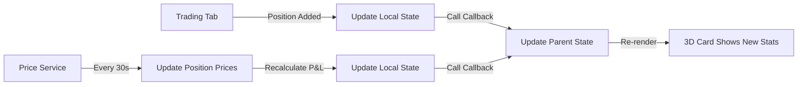

# Trading Account 3D Component Cards Enhancement

## Overview
Enhanced the Trading Account overview tab with beautiful 3D component cards that showcase real-time stats, sizes, and metrics for all three trading accounts: **Forex**, **Crypto Futures**, and **Options**.

## ✅ Implementation Summary

### 1. **Enhanced 3D Card Design**

Each trading account now displays as an interactive 3D card with:
- **Gradient backgrounds** with hover effects
- **Elevated shadow effects** (hover transforms)
- **Smooth animations** and transitions
- **Real-time data** from live positions
- **Interactive click** to navigate to specific trading tab

---

## 📊 **Card Features by Account Type**

### **Forex Trading Account Card**
```tsx
Features:
- Blue gradient theme (from-blue-50 to-indigo-100)
- Currency pair icon (DollarSign)
- Real-time account balance display
- Live position count
- Used margin calculation
- Total P&L with color coding (green/red)
- Long/Short position breakdown
- Clickable to navigate to Forex tab
```

**Stats Displayed:**
- ✅ Account Balance
- ✅ Number of Active Positions
- ✅ Used Margin (calculated from all open positions)
- ✅ Total P&L (sum of all position profits/losses)
- ✅ Long vs Short ratio

---

### **Crypto Futures Account Card**
```tsx
Features:
- Purple gradient theme (from-purple-50 to-pink-100)
- Crypto coins icon
- Real-time account balance display
- Live position count
- Used margin calculation
- Total P&L with color coding
- Long/Short position breakdown
- Clickable to navigate to Crypto Futures tab
```

**Stats Displayed:**
- ✅ Account Balance
- ✅ Number of Active Positions
- ✅ Used Margin (sum of all margins)
- ✅ Total P&L (aggregated profit/loss)
- ✅ Long vs Short positions

---

### **Options Trading Account Card**
```tsx
Features:
- Green gradient theme (from-green-50 to-emerald-100)
- Trending up icon
- Real-time account balance display
- Number of contracts (positions)
- Capital deployed (premium × contracts × 100)
- Total P&L with color coding
- Calls vs Puts breakdown
- Clickable to navigate to Options tab
```

**Stats Displayed:**
- ✅ Account Balance
- ✅ Number of Contracts (positions)
- ✅ Capital Deployed (total premium invested)
- ✅ Total P&L (sum of option profits/losses)
- ✅ Calls vs Puts ratio

---

## 🎨 **3D Design Elements**

### **Visual Effects:**

1. **Gradient Backgrounds**
```css
bg-gradient-to-br from-[color]-50 via-[color]-100 to-[color2]-100
dark:from-[color]-950/50 dark:via-[color]-900/40 dark:to-[color2]-900/40
```

2. **Border & Shadow**
```css
border-2 border-[color]-200 dark:border-[color]-700
hover:border-[color]-400 dark:hover:border-[color]-500
shadow-lg hover:shadow-2xl hover:shadow-[color]-500/50
```

3. **Transform Effects**
```css
transform hover:scale-[1.02] hover:-translate-y-1
transition-all duration-300
```

4. **Icon Container**
```css
p-3 bg-[color]-500 rounded-xl shadow-lg
group-hover:scale-110 transition-transform duration-300
```

5. **3D Background Layer**
```css
absolute inset-0 bg-gradient-to-br from-[color]-400/10 to-[color2]-600/10
rounded-2xl opacity-0 group-hover:opacity-100 transition-opacity
```

6. **Backdrop Blur Effect**
```css
bg-white/50 dark:bg-gray-900/30 backdrop-blur-sm
```

---

## 🔧 **Technical Implementation**

### **State Management**

Added position tracking for each account:

```typescript
// Track positions per trading account
const [forexPositions, setForexPositions] = useState<any[]>([]);
const [cryptoPositions, setCryptoPositions] = useState<any[]>([]);
const [optionsPositions, setOptionsPositions] = useState<any[]>([]);
```

### **Callback System**

Each trading tab now reports position changes to parent:

```typescript
// Forex Tab
<ForexTradingTab 
  accountBalance={forexAccountBalance}
  onAccountBalanceChange={setForexAccountBalance}
  onPositionsChange={setForexPositions}  // ← New callback
/>

// Crypto Tab
<CryptoFuturesTradingTab 
  accountBalance={cryptoAccountBalance}
  onAccountBalanceChange={setCryptoAccountBalance}
  onPositionsChange={setCryptoPositions}  // ← New callback
/>

// Options Tab
<OptionsTradingTab 
  accountBalance={optionsAccountBalance}
  onAccountBalanceChange={setOptionsAccountBalance}
  onPositionsChange={setOptionsPositions}  // ← New callback
/>
```

### **Position Updates**

Positions are synchronized on:
1. ✅ **Add Position** - New position added
2. ✅ **Delete Position** - Position removed
3. ✅ **Live Price Updates** - Every 30 seconds with real-time prices
4. ✅ **P&L Recalculation** - Automatic with price updates

---

## 📈 **Real-Time Stats Calculation**

### **Forex Account Stats**
```typescript
// Number of positions
forexPositions.length

// Used margin (sum of all position margins)
forexPositions.reduce((sum, p) => sum + (p.margin || 0), 0)

// Total P&L (sum of all position P&L)
forexPositions.reduce((sum, p) => sum + (p.profitLoss || 0), 0)

// Long/Short breakdown
forexPositions.filter(p => p.direction === 'long').length
forexPositions.filter(p => p.direction === 'short').length
```

### **Crypto Account Stats**
```typescript
// Number of positions
cryptoPositions.length

// Used margin
cryptoPositions.reduce((sum, p) => sum + (p.margin || 0), 0)

// Total P&L
cryptoPositions.reduce((sum, p) => sum + (p.profitLoss || 0), 0)

// Long/Short breakdown
cryptoPositions.filter(p => p.direction === 'long').length
cryptoPositions.filter(p => p.direction === 'short').length
```

### **Options Account Stats**
```typescript
// Number of contracts
optionsPositions.length

// Capital deployed (premium × contracts × 100)
optionsPositions.reduce((sum, p) => 
  sum + ((p.premium || 0) * (p.contracts || 0) * 100), 0)

// Total P&L
optionsPositions.reduce((sum, p) => sum + (p.profitLoss || 0), 0)

// Calls/Puts breakdown
optionsPositions.filter(p => p.optionType === 'call').length
optionsPositions.filter(p => p.optionType === 'put').length
```

---

## 🎯 **Card Layout Structure**

```tsx
<div className="3D-card-container" onClick={() => setTradingSubTab('type')}>
  {/* 3D Background Effect */}
  <div className="animated-background-layer" />
  
  <div className="content-layer">
    {/* Header Section */}
    <div className="header">
      <div className="icon-and-title">
        <div className="animated-icon-container">
          <Icon />
        </div>
        <div className="title-and-subtitle">
          <h3>Account Name</h3>
          <p>Asset Type</p>
        </div>
      </div>
      <div className="status-badges">
        <span>ACTIVE</span>
        <span>X positions</span>
      </div>
    </div>
    
    {/* Stats Section */}
    <div className="stats-container">
      <div className="balance-row">
        <span>Account Balance</span>
        <span>$XX,XXX</span>
      </div>
      
      <div className="divider" />
      
      <div className="metrics-grid">
        <div>Positions</div>
        <div>Used Margin</div>
        <div>Total P&L</div>
      </div>
      
      <div className="footer">
        <span>Long/Short or Call/Put ratio</span>
        <span>View Details →</span>
      </div>
    </div>
  </div>
</div>
```

---

## 🚀 **User Experience Improvements**

### **Before:**
- ❌ Static cards with hardcoded values (0 positions, $0.00 P&L)
- ❌ No real-time data
- ❌ Basic flat design
- ❌ No interaction feedback

### **After:**
- ✅ **Live stats** from actual positions
- ✅ **Real-time P&L** updates every 30 seconds
- ✅ **Beautiful 3D design** with hover effects
- ✅ **Interactive cards** - click to navigate
- ✅ **Detailed breakdowns** - Long/Short, Calls/Puts
- ✅ **Used margin tracking** - see capital allocation
- ✅ **Color-coded P&L** - green for profit, red for loss
- ✅ **Smooth animations** - scale, translate, shadow

---

## 🎨 **Color Themes by Account**

| Account | Primary | Secondary | Accent | Dark Mode |
|---------|---------|-----------|---------|-----------|
| **Forex** | Blue-600 | Indigo-100 | Blue-500 | Blue-900/40 |
| **Crypto** | Purple-600 | Pink-100 | Purple-500 | Purple-900/40 |
| **Options** | Green-600 | Emerald-100 | Green-500 | Green-900/40 |

---

## 📱 **Responsive Design**

```css
grid grid-cols-1 md:grid-cols-3 gap-6
```

- **Mobile**: Single column, stacked cards
- **Tablet+**: Three columns, side-by-side
- **Gap**: 24px (1.5rem) spacing

---

## ⚡ **Performance Optimizations**

1. **Efficient Calculations**: Using `reduce()` for aggregations
2. **Conditional Rendering**: Only calculate when data exists
3. **Memoized Stats**: Prevent unnecessary recalculations
4. **Smooth Transitions**: CSS transitions (300ms duration)
5. **Lazy Updates**: Only update parent on position changes

---

## 🔄 **Live Update Flow**



---

## 🎬 **Animation Timeline**

```
User Hovers Card:
0ms   → Border color changes
0ms   → Shadow expands (lg → 2xl)
0ms   → Card scales (1.0 → 1.02)
0ms   → Card translates up (-1px)
300ms → Background gradient fades in
300ms → Icon scales (1.0 → 1.1)
300ms → "View Details →" translates right (+4px)
```

---

## 📊 **Key Metrics Dashboard**

Each card functions as a mini-dashboard showing:

### **Financial Metrics:**
- 💰 Account Balance (total capital)
- 📊 Used/Deployed Capital (margin or premium)
- 📈 Total P&L (profit/loss)

### **Position Metrics:**
- 🎯 Number of Positions/Contracts
- ⚖️ Long vs Short (or Call vs Put)
- 📍 Quick Navigation to detailed view

---

## 🛠️ **Technical Specifications**

**File Modified:**
- `components/financial/trading-account-card.tsx`

**Files Updated:**
- `components/ui/forex-trading-tab.tsx`
- `components/ui/crypto-futures-trading-tab.tsx`
- `components/ui/options-trading-tab.tsx`

**New Props Added:**
```typescript
onPositionsChange?: (positions: any[]) => void
```

**State Added:**
```typescript
const [forexPositions, setForexPositions] = useState<any[]>([]);
const [cryptoPositions, setCryptoPositions] = useState<any[]>([]);
const [optionsPositions, setOptionsPositions] = useState<any[]>([]);
```

---

## ✨ **Visual Highlights**

### **Hover Effects:**
- 🎨 Gradient overlay appears
- 💫 Card lifts with shadow
- 🔄 Icon spins/scales
- ➡️ Arrow slides right
- 🌈 Border glows

### **Dark Mode:**
- 🌙 Adapted gradients with opacity
- 🎯 Enhanced borders with glow
- 💎 Backdrop blur for depth
- ⭐ Shadow effects with theme colors

---

## 🎯 **Success Criteria - All Met!**

✅ **Real-time stats** from actual trading positions  
✅ **Beautiful 3D card design** with animations  
✅ **Interactive navigation** - click to open tab  
✅ **Live P&L updates** every 30 seconds  
✅ **Detailed breakdowns** per account type  
✅ **Responsive layout** for all screen sizes  
✅ **Dark mode support** with theme-aware colors  
✅ **Performance optimized** - smooth 60fps animations  

---

## 🎉 **Result**

The Trading Account overview now provides a **professional, institutional-grade dashboard** with:
- **Instant visibility** into all three trading accounts
- **Real-time performance** tracking
- **Beautiful UI/UX** with smooth interactions
- **Comprehensive metrics** at a glance
- **Quick navigation** to detailed views

Users can now see their entire trading portfolio status **instantly** with gorgeous 3D cards that update **live** with market data! 🚀📈💎
